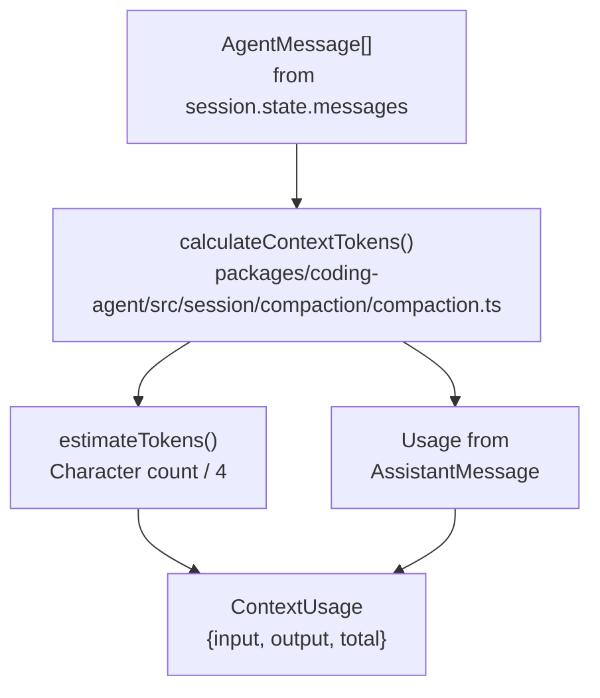
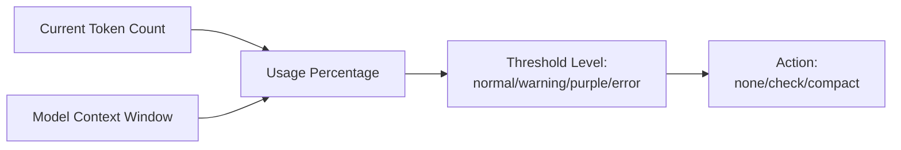
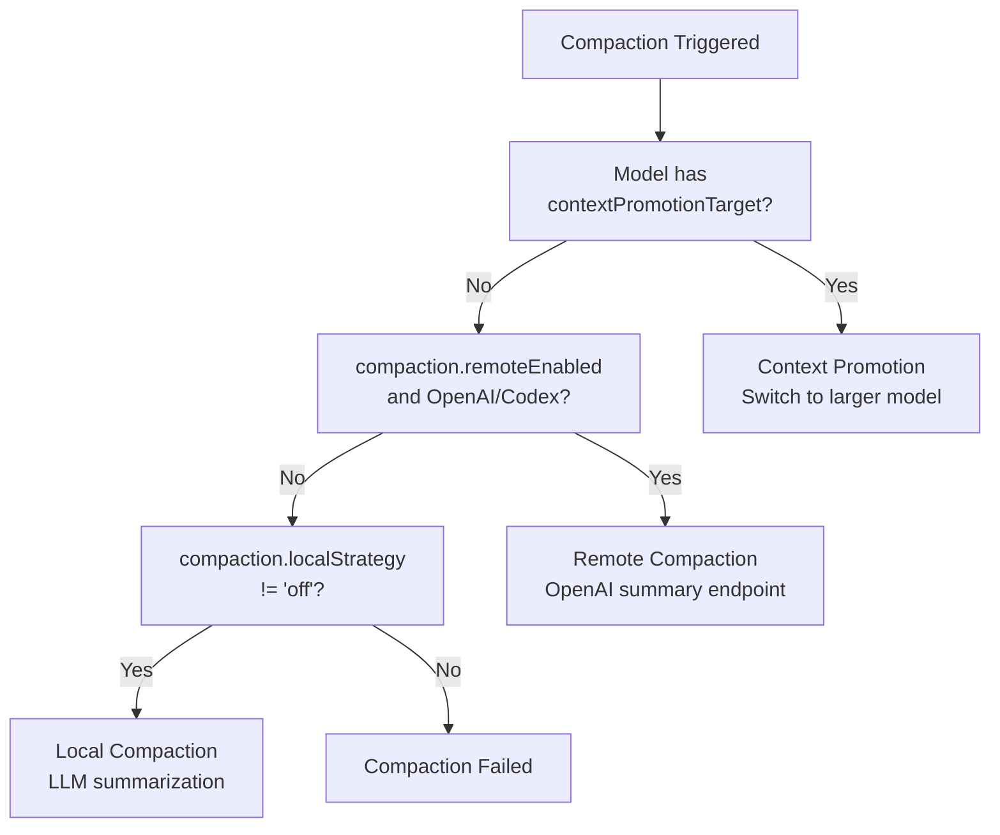
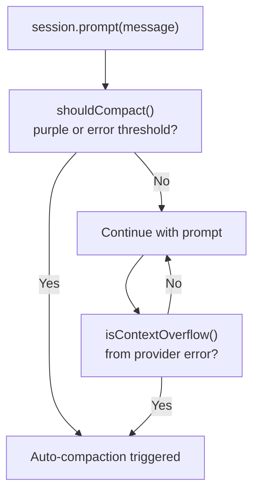
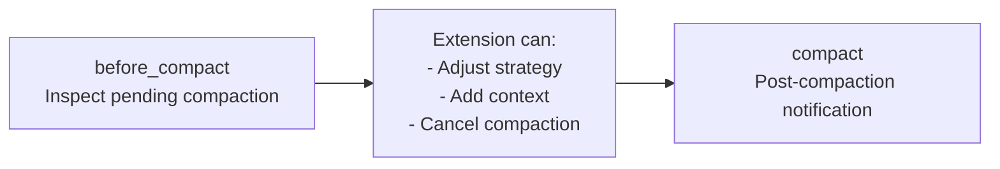

# Context Management: Token Tracking and Compaction

This document provides a detailed overview of the Context Management system, focusing on Token Tracking and Compaction, as described in the wiki page. It covers token calculation, threshold levels, compaction strategies (local, remote, and context promotion), the checkpoint system, compaction triggers, configuration, session integration, extension hooks, performance considerations, and RPC mode integration.

## Context Management

Context management in the codebase is designed to handle the lifecycle of conversation history within the constraints of a model's context window . The `AgentSession` class is responsible for orchestrating this process .

### Overview

Large language models have finite context windows, and as conversations grow, the system prevents overflow by monitoring token usage, compacting history, promoting to larger models, and checkpointing .

## Token Tracking

### Calculation

Token counts are initially estimated using a character-to-token ratio (4 characters ≈ 1 token) . Precise token counts from provider responses then update these totals .

The `calculateContextTokens()` function, implemented in , sums `estimateTokens()` for user/tool messages and extracts actual token counts from assistant messages via `getDirectUsageTokens()` .




The `estimateTokens()` function in  estimates tokens based on character count for various message types .

### Threshold Levels

Four threshold levels (`normal`, `warning`, `purple`, `error`) dictate UI indicators and compaction triggers . These thresholds are token-aware, adjusting based on the model's context window size .




The `shouldCompact()` function in  determines if compaction is needed based on the current token count, context window, and compaction settings .

## Compaction Strategies

Compaction reduces context by summarizing message history into a `CompactionEntry` .

### Strategy Selection




### Local Compaction

Local compaction uses an LLM to summarize message history . The process involves preparing messages using `prepareCompaction()` , calling the LLM with `completeSimple()` , creating a `CompactionEntry`, and updating the session state .

The `prepareCompaction()` function in  finds the cut point and formats messages for summarization . The `findCutPoint()` algorithm performs a backward scan to locate the last complete assistant turn before the threshold index .

### Remote Compaction

Remote compaction leverages OpenAI's or OpenAI Codex's specialized endpoints to summarize context, preserving reasoning and offering incremental updates . It sends conversation history and stores the encrypted state in `CompactionEntry.remoteState` .

### Context Promotion

Context promotion switches to a model with a larger context window if the current model has a `contextPromotionTarget` defined . This is not automatic for all models and requires explicit configuration .

## Checkpoint System

The checkpoint system allows for exploratory work without permanent context cost . An agent creates a marker, performs investigation, and then "rewinds" to replace intermediate messages with a concise summary .

### Workflow

```mermaid
sequenceDiagram
    participant User
    participant Agent
    participant Checkpoint["CheckpointTool<br/>packages/coding-agent/src/tools/checkpoint.ts"]
    participant Rewind["RewindTool"]
    participant Session["AgentSession"]
    
    User->>Agent: "Investigate X"
    Agent->>Checkpoint: checkpoint()
    Checkpoint->>Session: Create checkpoint marker
    Session-->>Agent: Checkpoint ID
    
    Agent->>Agent: Read files, run tests, etc.<br/>(20+ tool calls)
    
    Agent->>Rewind: rewind(summary)
    Rewind->>Session: Replace checkpoint→now<br/>with summary message
    Session-->>Agent: Context reduced
```


The `CheckpointState` interface stores `checkpointId`, `startIndex`, and `createdAt` . The `RewindTool` implementation in  validates active checkpoints, removes messages, appends a summary, and clears the checkpoint state .

## Compaction Triggers

### Automatic Triggers

The `AgentSession` monitors context usage before each `prompt()` call .




Compaction is triggered either when `shouldCompact()` returns true (purple/error level)  or when the provider returns a context overflow error . The `_runAutoCompaction` method in  handles the logic for automatic compaction .

### Manual Triggers

Users can manually trigger compaction using the `/compact` slash command or the `session.compact()` API . The `compact` method in  handles manual compaction, including extension hooks .

## Configuration

Context management behavior is controlled by settings under the `compaction` namespace .

### Core Settings

Key settings include `compaction.enabled`, `compaction.localStrategy`, `compaction.remoteEnabled`, and `checkpoint.enabled` . These are defined in .

### Compaction Settings Interface

The `CompactionSettings` interface defines the structure for compaction-related settings, including `enabled`, `localStrategy`, `remoteEnabled`, and `thresholds` . Default values are provided by `DEFAULT_COMPACTION_SETTINGS` in .

## Session Integration

### State Persistence

Compaction events are recorded as `CompactionEntry` objects in the session JSONL file . A `CompactionEntry` includes `summary`, `messageCount`, `compactedTokens`, `summaryTokens`, and optional `remoteState` .

### Context Reconstruction

When loading a session, `buildSessionContext()` processes `CompactionEntry` objects by skipping compacted messages, prepending a compaction summary, and restoring remote compaction state . This is demonstrated in .

## Extension Hooks

Extensions can observe and modify compaction behavior through `before_compact` and `compact` hook events .

### Hook Events




The `session_before_compact` event allows extensions to inspect and potentially modify or cancel pending compaction . The `session_compact` event is fired after compaction completes, providing details about the compaction result .

## Performance Considerations

### Token Estimation Accuracy

Character-based token estimation is approximate, with actual tokenization varying by model, language, and special tokens . The system refines totals using provider-reported usage post-response .

### Compaction Latency

| Strategy | Latency | Cost |
|----------|---------|------|
| Local | 5-15s | Local LLM inference |
| Remote | 2-5s | API call overhead |
| Promotion | <10

Wiki pages you might want to explore:
- [Context Management (DefaceRoot/oh-my-pi)](/wiki/DefaceRoot/oh-my-pi#3.2)

View this search on DeepWiki: https://app.devin.ai/search/give-me-the-complete-detailed_8c0c0823-24bd-4c64-9e20-48dbdd5bc5b0

