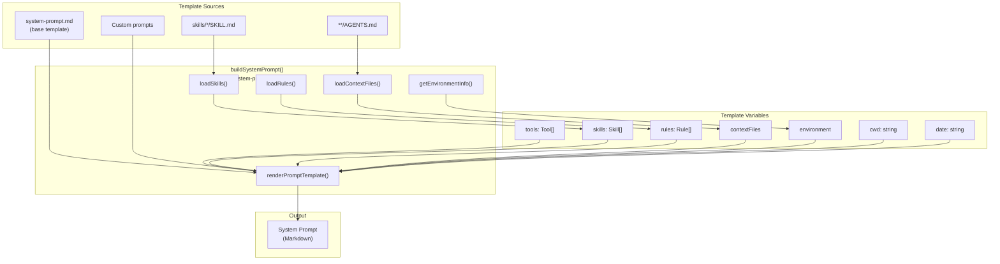
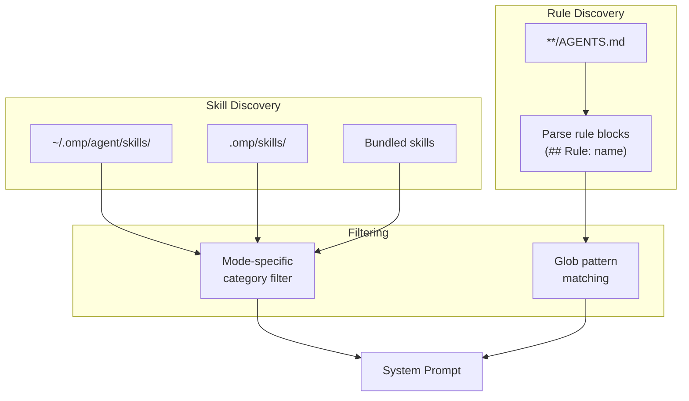

# System Prompts: Instruction Construction

This document details the 'System Prompts: Instruction Construction' section from the 'Core Concepts' wiki page, covering how system prompts are built, the different modes they support, how tool descriptions are integrated, and the role of skills and rules. 

## System Prompts: Instruction Construction

### Template-Based Construction

System prompts are constructed using markdown templates with Handlebars-like syntax by the `buildSystemPrompt()` function.  This function, located in `packages/coding-agent/src/system-prompt.ts`, composes the final prompt from several sources: 

1.  **Core instructions**: These come from `system-prompt.md`, which defines behavior guidelines, tool descriptions, and contract rules. 
2.  **Skills**: These are loaded from `.omp/skills/` and filtered based on the current execution mode. 
3.  **Rules**: Discovered from `AGENTS.md` files, these provide domain-specific guidance. 
4.  **Context files**: Content from `AGENTS.md` files in the project and parent directories. 
5.  **Environment info**: Details such as OS, CPU, GPU, terminal, and working directory. 
6.  **Append prompts**: Custom additions provided via CLI or extensions. 

The `custom-system-prompt.md` file also contributes to the system prompt by including `systemPromptCustomization`, `customPrompt`, `appendPrompt`, `contextFiles`, `git` information, `skills`, and `rules`. 

The overall construction pipeline is visualized as follows: 

### Mode-Specific Prompts

The system supports four execution modes, each with distinct prompt templates: 

*   **default**: This mode uses the `{{#when mode "==" "default"}}` template section and supports full editing, testing, and verification workflows. 
*   **orchestrator**: This mode uses `{{#when mode "==" "orchestrator"}}` and is focused on delegation with minimal direct editing. 
*   **plan**: This mode uses `{{#when mode "==" "plan"}}` and is for research and planning, generating `PLAN.md` artifacts. 
*   **ask**: This mode uses `{{#when mode "==" "ask"}}` and is focused on Q&A with minimal tool usage. 

These modes are selected via model roles in `roles.yml` and determine available tools and instructions for the agent.  The `system-prompt.md` file contains sections for these mode-specific instructions. 

### Tool Descriptions

Tool descriptions are injected into the system prompt using a Handlebars `{{#each toolInfo}}` loop. 

If `settings.repeatToolDescriptions` is true, full tool schemas are included, increasing context usage but improving tool selection accuracy.  The `INTENT_FIELD` parameter is added to tool schemas when `settings.tools.intentTracing` is enabled, requiring the agent to describe the intent of each tool call. 

### Skills and Rules

**Skills** are reusable capabilities discovered from: 

*   `~/.omp/agent/skills/` 
*   `.omp/skills/` 
*   Bundled skills within the distribution 

Each skill has a `SKILL.md` file that describes its purpose and usage, and skills are filtered by category based on the current mode.  For example, the `system-prompts` skill provides guidance on writing system prompts, tool documentation, and agent definitions. 

**Rules** are domain-specific guidelines found in `AGENTS.md` files within the project hierarchy.  They use glob patterns to match file paths and inject relevant guidance.  Rules can be configured with frontmatter to `alwaysApply` or apply based on `globs`. 

The discovery and filtering process for skills and rules is illustrated below: 

## Notes

The provided context focuses on the construction and components of system prompts within the `oh-my-pi` codebase. It details how various elements like core instructions, skills, rules, and environment information are combined to form the final system prompt. The `create-prompt.md` file, while related to prompt creation, describes the process for a user to create prompts rather than the internal system prompt construction mechanism.  

Wiki pages you might want to explore:
- [Core Concepts (DefaceRoot/oh-my-pi)](/wiki/DefaceRoot/oh-my-pi#3)

View this search on DeepWiki: https://app.devin.ai/search/give-me-the-complete-detailed_fbc15f98-277c-4579-8011-2da17ce02184

