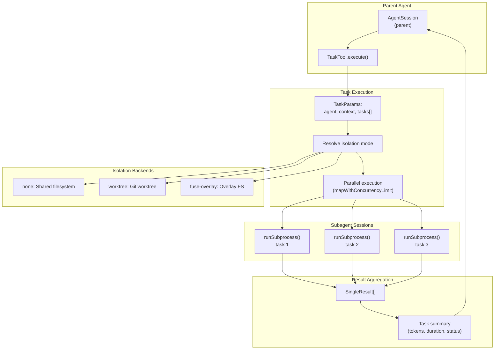
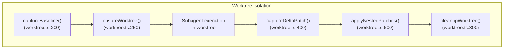

# Task Delegation: Hierarchical Work Decomposition

This document provides detailed documentation for the 'Task Delegation: Hierarchical Work Decomposition' concept within the 'Core Concepts' section of the `DefaceRoot/oh-my-pi` codebase. It covers the architecture, agent definitions, isolation modes, subagent communication, and parallel execution as described in the wiki page.

## Task Delegation: Hierarchical Work Decomposition

The `task` tool in `oh-my-pi` enables agents to delegate work to specialized subagents, facilitating hierarchical work decomposition . Each subagent operates in an isolated session with its own model, tools, and context .

### Task Tool Architecture

The `TaskTool` class, located in `packages/coding-agent/src/task/index.ts`, implements the `task` tool contract . It delegates each task item to `runSubprocess(...)` from `src/task/executor.ts` .

The execution flow involves:
1.  **Parent Agent**: The `AgentSession` of the parent agent initiates the `task` tool .
2.  **Task Execution**: The `TaskTool.execute()` method processes `TaskParams`, resolves the isolation mode, and executes tasks in parallel using `mapWithConcurrencyLimit()` .
3.  **Subagent Sessions**: Each task is run as a subprocess, creating isolated `AgentSession` instances .
4.  **Result Aggregation**: After subagent completion, results are aggregated, including a summary of tokens, duration, and status .




### Agent Definitions

Agent definitions specify specialized roles for subagents . These definitions are discovered from:
*   Bundled agents in `@oh-my-pi/pi-coding-agent/agents/` 
*   User-level definitions in `~/.omp/agent/agents/*.md` 
*   Project-level definitions in `.omp/agents/*.md` 

Each agent definition includes:
*   **Tools**: A subset of available tools (e.g., `read`, `grep`, `report_finding` for reviewer agents) .
*   **System prompt**: Role-specific instructions .
*   **Blocking mode**: Indicates if the subagent must complete before the parent continues .
*   **Model overrides**: Optional model selection for the subagent .

An example agent definition structure is:
```markdown
# Agent: implement

Tools: read, write, edit, grep, find, bash, python, lsp, todo_write

## System Prompt
You are an implementation specialist. Given a design, implement it precisely...
```


The `plan` agent, for instance, is defined in `packages/coding-agent/src/prompts/agents/plan.md`  and `agent/agents/plan.md` . It specifies tools like `read`, `grep`, `find`, `bash`, `lsp`, `fetch`, `web_search`, `ast_grep`, `write`, and `edit` . It also defines `spawns` for `explore`, `librarian`, and `oracle` subagents .

### Isolation Modes

Subagents can run in different isolation modes to manage filesystem changes .
| Mode | Implementation | Use Case |
|---|---|---|
| **none** | Shared filesystem | Simple tasks, no risk of conflicts |
| **worktree** | Git worktree per task | Parallel work on same files, easy merge |
| **fuse-overlay** | OverlayFS (Linux/macOS) | Maximum isolation, expensive setup |
| **fuse-projfs** | ProjFS (Windows) | Windows equivalent of overlay |


Worktree and FUSE modes create isolated filesystems for each subagent, capturing changes as patches to be applied back to the parent .

The `worktree` isolation lifecycle is as follows:



The `task.isolation.merge` setting controls how isolated changes are integrated back, either by `patch` (default) or `branch` . The `task.isolation.commits` setting (`generic` or `ai`) controls commit messages .

### Subagent Communication

Subagents communicate via:
1.  **Event streaming**: `AgentEvents` are forwarded to the parent via `EventBus` on the channel `task:subagent:event` .
2.  **Progress updates**: Aggregated progress is forwarded on the channel `task:subagent:progress` .
3.  **Tool result extraction**: Special handling for `submit_result` and `report_finding` tools .

The `runSubprocess()` function in `packages/coding-agent/src/task/executor.ts` manages the creation of isolated `AgentSession` instances, forwarding MCP tool calls, and extracting structured output .

### Parallel Execution

The `mapWithConcurrencyLimit()` utility from `packages/coding-agent/src/task/parallel.ts` manages concurrent subagent execution with a semaphore .
```typescript
const semaphore = new Semaphore(maxConcurrency);
const results = await mapWithConcurrencyLimit(
  tasks,
  async (task) => {
    await semaphore.acquire();
    try {
      return await executeTask(task);
    } finally {
      semaphore.release();
    }
  },
  maxConcurrency
);
```

The default concurrency limit is configurable via `settings.task.maxConcurrency` (default: 32) .

## Notes

The provided context focuses on the `task` tool and its underlying mechanisms for delegating work to subagents. Other sections of the 'Core Concepts' wiki page, such as 'Agent Sessions', 'Context Management', and 'System Prompts', were not included as they were not directly related to the user's query about 'Task Delegation'.

Wiki pages you might want to explore:
- [Core Concepts (DefaceRoot/oh-my-pi)](/wiki/DefaceRoot/oh-my-pi#3)

View this search on DeepWiki: https://app.devin.ai/search/give-me-the-complete-detailed_1fa28fda-1347-46a8-8b0e-f73a5c1ad575

