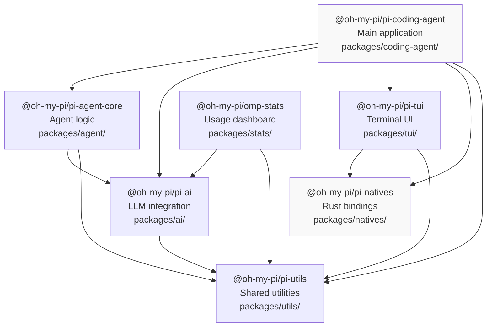

# Monorepo Packages

The user is asking for the complete documentation of the 'Monorepo Packages' section from the `README.md` file in the `DefaceRoot/oh-my-pi` repository. This includes details about the packages, their descriptions, and the dependency graph.

## Monorepo Packages

The `oh-my-pi` project is structured as a monorepo containing several published packages, each with a specific role and well-defined dependencies .

### Package List and Descriptions

The monorepo includes the following packages :

*   **`@oh-my-pi/pi-ai`** (`packages/ai`): This package provides a multi-provider LLM client, handling streaming and integration with various models and providers .
*   **`@oh-my-pi/pi-agent-core`** (`packages/agent`): This package contains the core agent runtime, responsible for tool calling and state management .
*   **`@oh-my-pi/pi-coding-agent`** (`packages/coding-agent`): This is the main interactive coding agent CLI and SDK .
*   **`@oh-my-pi/pi-tui`** (`packages/tui`): This package offers a Terminal User Interface (TUI) library with differential rendering capabilities .
*   **`@oh-my-pi/pi-natives`** (`packages/natives`): This package provides N-API bindings for various native functionalities such as `grep`, shell operations, image processing, text manipulation, and syntax highlighting .
*   **`@oh-my-pi/omp-stats`** (`packages/stats`): This package includes a local observability dashboard for tracking AI usage statistics .
*   **`@oh-my-pi/pi-utils`** (`packages/utils`): This package contains shared utilities, including logging, stream handling, and helpers for directories, environment variables, and processes .
*   **`@oh-my-pi/swarm-extension`** (`packages/swarm-extension`): This is an extension package for swarm orchestration .

### Dependency Graph

The relationships between these packages are visualized in the following diagram :

The `bun.lock` file also shows these workspace dependencies, for example, `@oh-my-pi/pi-coding-agent` depends on `@oh-my-pi/omp-stats`, `@oh-my-pi/pi-agent-core`, `@oh-my-pi/pi-ai`, `@oh-my-pi/pi-natives`, `@oh-my-pi/pi-tui`, and `@oh-my-pi/pi-utils` . Similarly, `@oh-my-pi/pi-agent-core` depends on `@oh-my-pi/pi-ai` and `@oh-my-pi/pi-utils` .

### Dependency Rules

The monorepo adheres to specific dependency rules to maintain a clean and manageable structure :

*   There are no circular dependencies between packages .
*   `pi-utils` is a foundational package with no dependencies of its own .
*   `pi-natives` only depends on `pi-utils`, serving as a platform abstraction layer .
*   `pi-ai` provides LLM abstraction and does not have any UI-related dependencies .
*   `pi-coding-agent` acts as the top-level orchestrator, integrating all other components .

### Rust Crates

In addition to the JavaScript/TypeScript packages, the monorepo also includes several Rust crates :

*   **`pi-natives`** (`crates/pi-natives`): This is the core Rust native addon utilized by the `@oh-my-pi/pi-natives` package .
*   **`brush-core-vendored`** (`crates/brush-core-vendored`): A vendored fork of `brush-shell` used for embedded bash execution .
*   **`brush-builtins-vendored`** (`crates/brush-builtins-vendored`): Contains vendored bash builtins such as `cd`, `echo`, `test`, `printf`, `read`, and `export` .

## Notes

The user's prompt specifically asked for the 'Monorepo Packages' section under the 'README' section. The provided context included a wiki page named "Overview" which also contained a "Package Structure" section with similar information. The answer prioritizes the information directly from the `README.md` file as requested, but also incorporates details from the "Overview" wiki page where it provides additional context, such as the dependency rules and the mermaid diagram. The `bun.lock` file was used to confirm some of the package dependencies. The `agent/skills/monorepo-management/SKILL.md` file, while related to monorepo management, describes a skill for the agent rather than the structure of the `oh-my-pi` monorepo itself, and thus was not included in the detailed documentation of the project's monorepo packages.

Wiki pages you might want to explore:
- [Overview (DefaceRoot/oh-my-pi)](/wiki/DefaceRoot/oh-my-pi#1)

View this search on DeepWiki: https://app.devin.ai/search/give-me-the-complete-detailed_004f127e-83b1-4fdf-ac21-2ebe219ce927

