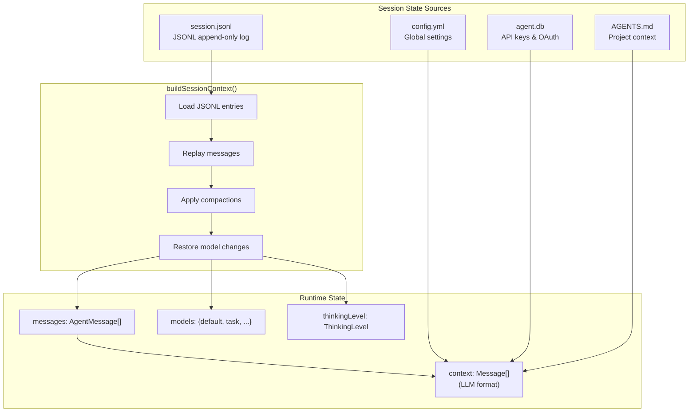

# Branching

This document provides detailed information about the 'Branching' functionality within the 'Sessions' section of the `oh-my-pi` codebase. It covers in-place navigation within a session tree, creating new session files through branching or forking, and the underlying mechanisms for managing session history and state.  

## Branching

Branching in `oh-my-pi` allows you to explore alternative conversational paths without losing previous work. There are two primary ways to branch: in-place navigation within the session tree and creating new session files. 

### In-place Navigation (`/tree`)

The `/tree` command enables navigation within the existing session tree without creating new session files.  This is handled by the `navigateTree` method of the `AgentSession` class. 

#### Features:
*   **Search and Paging**: You can search by typing and navigate through pages using the left and right arrow keys. 
*   **Filter Modes**: Toggle between different filter modes using `Ctrl+O`: `default`, `no-tools`, `user-only`, `labeled-only`, and `all`. 
*   **Labeling Entries**: Press `Shift+L` to label entries, effectively bookmarking them for easier navigation. 

The `navigateTree` function in `AgentSession` is responsible for moving to a different node in the session tree.  It takes a `targetId` (the entry ID to navigate to) and options for summarization.  If summarization is requested, it collects entries from the old leaf to a common ancestor using `collectEntriesForBranchSummary`  and generates a summary.  The session's messages are then replaced with the context of the new branch. 

#### Branch Summary Generation
When navigating the tree with summarization, the `collectEntriesForBranchSummary` function identifies the common ancestor between the old and new branches and gathers the entries from the old leaf up to this common ancestor.  These entries are then summarized by the `generateBranchSummary` function, which uses an LLM to create a concise summary of the abandoned path.  The summary is prepended with a preamble and includes file operations (read and modified files). 

### Creating New Sessions (`/branch` / `/fork`)

The `/branch` and `/fork` commands create new session files from a selected previous message. 

#### `/branch` Command
The `/branch` command in `builtin-registry.ts` invokes either `showTreeSelector()` or `showUserMessageSelector()` based on the `doubleEscapeAction` setting.  The `AgentSession.branch` method is then called with the `entryId` of the selected message. 

The `AgentSession.branch` method performs the following steps:
1.  It retrieves the selected user message based on the `entryId`. 
2.  It emits a `session_before_branch` event, which can be cancelled by extensions. 
3.  Pending messages are cleared, and the session manager flushes any pending writes. 
4.  A new session is created using `sessionManager.newSession()` if the selected entry has no parent, or `sessionManager.createBranchedSession()` otherwise. 
5.  The agent's session ID is updated, and the session context is rebuilt from the new branch. 
6.  A `session_branch` event is emitted to extensions. 
7.  The agent's messages are replaced with the new session context. 

#### `/fork` Command
The `/fork` command in `builtin-registry.ts` handles the creation of a new fork from a previous message.  This typically involves creating a new session file that copies the history from another session file, but places it in the current project's session directory.  The `SessionManager.forkFrom` static method is used for this purpose. 

### Session Manager Branching Logic

The `SessionManager` class is central to managing session branches. 

*   **`branch(branchFromId: string)`**: This method moves the "leaf pointer" to a specified entry.  Subsequent `appendXXX()` calls will create children of this new branch point. 
*   **`resetLeaf()`**: Resets the leaf pointer to null, causing the next appended entry to become a new root. 
*   **`branchWithSummary(branchFromId: string | null, summary: string, ...)`**: Similar to `branch()`, but also appends a `branch_summary` entry to capture context from the abandoned conversation path. 
*   **`createBranchedSession(leafId: string)`**: This method creates a new session file containing only the path from the root to the specified `leafId`.  It filters out label entries, creates a new session header, and writes the relevant entries to a new `.jsonl` file. 

### Session Tree Structure

The `SessionManager.getTree()` method returns the session as a tree structure, where each node represents a `SessionEntry`.  This tree can have multiple branches, as demonstrated in the `tree-traversal.test.ts` file. 

**Session State Reconstruction from Persistent Sources** 

The `buildSessionContext()` function in `SessionManager` replays the JSONL log to reconstruct runtime state.  Each entry type (message, compaction, model change, thinking level change) is processed sequentially to rebuild the conversation history. 

## Notes

The provided context primarily focuses on the `AgentSession` and `SessionManager` classes, which are responsible for handling branching logic. The `README.md` provides a high-level overview of the branching features, while the test files (`agent-session-branching.test.ts`, `tree-traversal.test.ts`, `build-context.test.ts`) offer concrete examples of how branching is tested and expected to behave.       The `rpc-client.ts` file shows how branching functionality is exposed via RPC. 

Wiki pages you might want to explore:
- [Core Concepts (DefaceRoot/oh-my-pi)](/wiki/DefaceRoot/oh-my-pi#3)

View this search on DeepWiki: https://app.devin.ai/search/give-me-the-complete-detailed_84f4b0c9-3b34-4901-b1cd-220deae4f0f4

