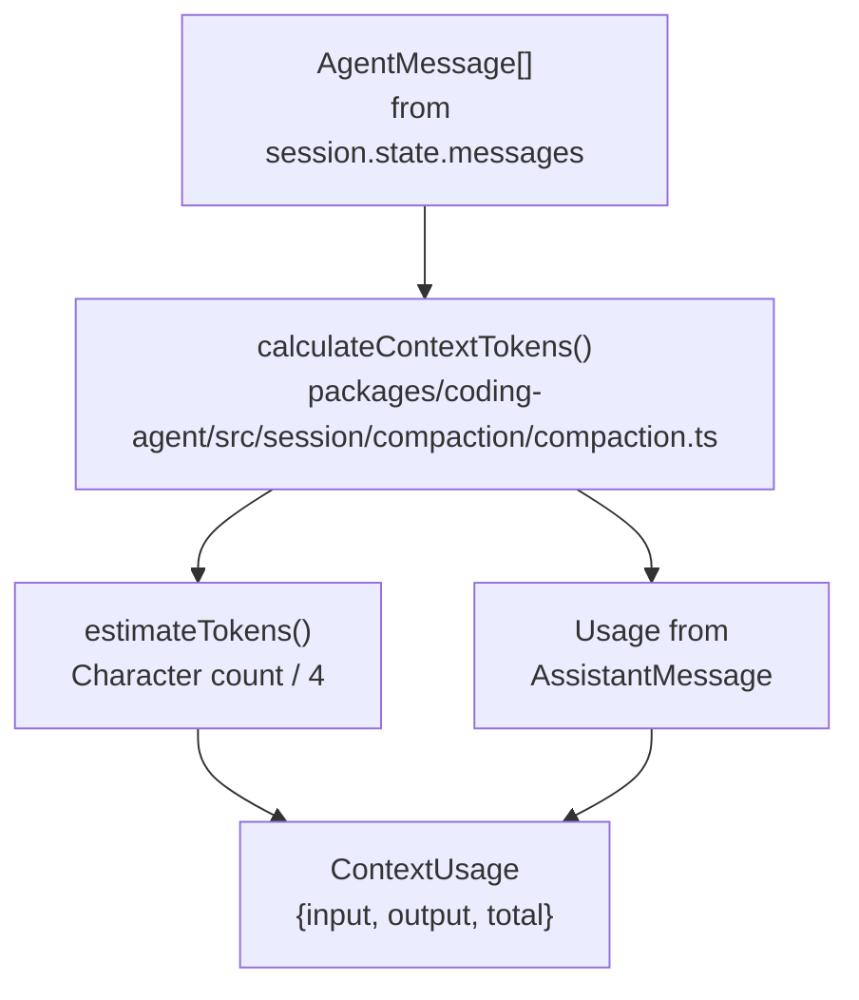
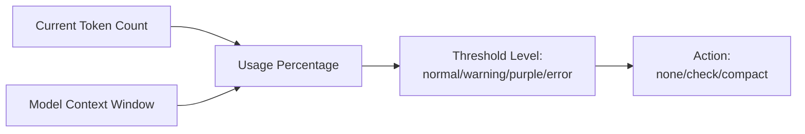
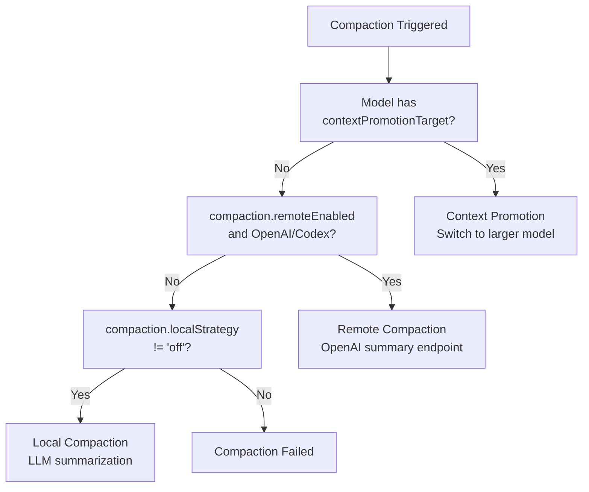
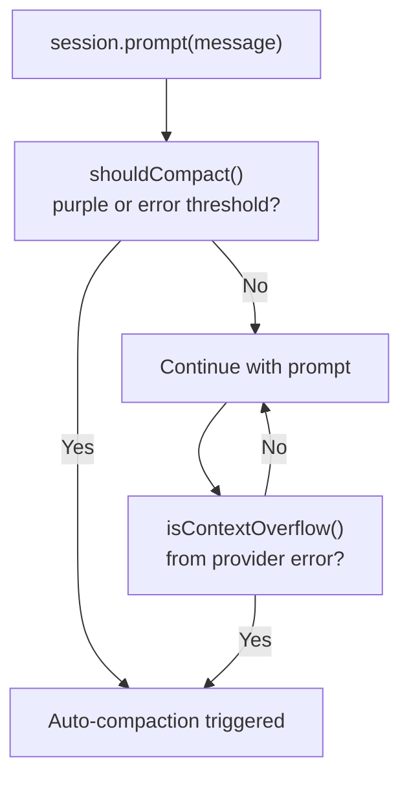

# Context Compaction

This document provides detailed documentation for Context Compaction, a feature designed to manage conversation history within the finite context windows of large language models. It covers token tracking, compaction strategies, the checkpoint system, triggers, configuration, session integration, extension hooks, performance considerations, and RPC mode integration. 

## Overview 
Large language models have finite context windows, and as conversations grow, the system prevents overflow by monitoring token usage, compacting history, promoting to larger models, and checkpointing.  The `AgentSession` class orchestrates this process. 

## Token Tracking 

### Calculation 
Token counts are estimated using a character-to-token ratio (4 characters ≈ 1 token) for user/assistant messages and tool results.  Actual usage from provider responses updates totals with precise counts. 



The `calculateContextTokens()` function, implemented in `packages/coding-agent/src/session/compaction/compaction.ts`, sums `estimateTokens()` for user/tool messages and extracts actual token counts from assistant messages via `getDirectUsageTokens()`, returning `ContextUsage`. 

### Threshold Levels 
Four threshold levels (normal, warning, purple, error) determine UI indicators and compaction triggers.  These thresholds are token-aware, adjusting based on the model's context window size. 

| Threshold | Percentage | Trigger |
|---|---|---|
| **normal** | 0-70% | Green indicator, no action |
| **warning** | 70-85% | Yellow indicator, pre-compaction check |
| **purple** | 85-95% | Purple indicator, compaction imminent |
| **error** | >95% | Red indicator, compaction required | 



## Compaction Strategies 
Compaction reduces context by summarizing message history into a `CompactionEntry`.  Three strategies are supported: local compaction, remote compaction, and context promotion. 

### Strategy Selection 


### Local Compaction 
This strategy uses an LLM, configured via `compaction.localStrategy`, to generate a summary of message history.  The process involves preparing messages using `prepareCompaction()`, calling the LLM with a compaction prompt, creating a `CompactionEntry`, and updating the session state.  The `findCutPoint()` function, implemented in `packages/coding-agent/src/session/compaction/compaction.ts`, determines the last complete assistant turn before the threshold index. 

### Remote Compaction 
Remote compaction utilizes OpenAI's or OpenAI Codex's specialized endpoints to reduce tokens while preserving reasoning.  It features encrypted reasoning, incremental updates, and efficiency by avoiding re-summarization.  The implementation in `packages/coding-agent/src/session/compaction/remote.ts` sends conversation history and stores the received compacted state blob in `CompactionEntry.remoteState`. 

| Provider | Endpoint | State Field |
|---|---|---|
| OpenAI | `/chat/compact` | `remoteCompactionState` |
| OpenAI Codex | `/compaction` | `codexCompactionState` | 

### Context Promotion 
This strategy switches to a model with a larger context window if the current model has an explicit `contextPromotionTarget`. 

```typescript
interface Model {
  contextPromotionTarget?: string; // Model ID to promote to
  contextWindow?: number;          // Current model's window
}
``` 

The promotion process involves checking for a `contextPromotionTarget`, resolving the target model, emitting a `ModelChangeEntry` to the session log, and continuing without compaction.  Promotion is not automatic for all models. 

## Checkpoint System 
Checkpoints allow for exploratory work without permanent context cost.  The agent creates a marker, performs investigation, and then "rewinds" to replace intermediate messages with a concise summary. 

### Workflow 
```mermaid
sequenceDiagram
    participant User
    participant Agent
    participant Checkpoint["CheckpointTool<br/>packages/coding-agent/src/tools/checkpoint.ts"]
    participant Rewind["RewindTool"]
    participant Session["AgentSession"]
    
    User->>Agent: "Investigate X"
    Agent->>Checkpoint: checkpoint()
    Checkpoint->>Session: Create checkpoint marker
    Session-->>Agent: Checkpoint ID
    
    Agent->>Agent: Read files, run tests, etc.<br/>(20+ tool calls)
    
    Agent->>Rewind: rewind(summary)
    Rewind->>Session: Replace checkpoint→now<br/>with summary message
    Session-->>Agent: Context reduced
``` 

The `CheckpointState` interface defines the structure for a checkpoint, including `checkpointId`, `startIndex`, and `createdAt`.  This state is stored in `AgentSession.#checkpointState`.  The `RewindTool` implementation in `packages/coding-agent/src/tools/checkpoint.ts` validates active checkpoints, removes messages, appends a user message with the investigation summary, and clears the checkpoint state. 

## Compaction Triggers 

### Automatic Triggers 
The `AgentSession` monitors context usage before each `prompt()` call. 



Compaction is triggered when `shouldCompact()` returns true (purple/error level) or when the provider returns a context overflow error, parsed by `isContextOverflow()`. 

### Manual Triggers 
Users can manually trigger compaction using the `/compact` slash command, the `session.compact()` programmatic API, or extension hooks (`before_compact` / `compact` events).  The `handleCompactCommand` function in `packages/coding-agent/src/modes/controllers/command-controller.ts` is responsible for handling the `/compact` command.  It checks if there are enough messages to compact and then calls `executeCompaction`.  The `executeCompaction` function then calls `this.ctx.session.compact(instructions, options)` to perform the actual compaction. 

## Configuration 
Context management behavior is controlled by settings under the `compaction` namespace. 

### Core Settings 
| Setting | Type | Default | Description |
|---|---|---|---|
| `compaction.enabled` | boolean | `true` | Enable automatic compaction |
| `compaction.localStrategy` | enum | `"default"` | LLM role for local compaction (`"default"`, `"orchestrator"`, `"off"`) |
| `compaction.remoteEnabled` | boolean | `true` | Enable OpenAI/Codex remote compaction |
| `checkpoint.enabled` | boolean | `true` | Enable checkpoint/rewind tools | 

These settings are defined in `packages/coding-agent/src/config/settings-schema.ts`. 

### Compaction Settings Interface 
```typescript
interface CompactionSettings {
  enabled: boolean;
  localStrategy: ModelRole | "off";
  remoteEnabled: boolean;
  // Internal threshold configuration
  thresholds: {
    normal: number;    // 0.70
    warning: number;   // 0.85
    purple: number;    // 0.95
    error: number;     // 0.98
  };
}
``` 

Default values are provided by `DEFAULT_COMPACTION_SETTINGS`. 

## Session Integration <cite repo="DefaceRoot/oh-my-pi" path="Context Management" start="2

Wiki pages you might want to explore:
- [Context Management (DefaceRoot/oh-my-pi)](/wiki/DefaceRoot/oh-my-pi#3.2)

View this search on DeepWiki: https://app.devin.ai/search/give-me-the-complete-detailed_41355282-05da-4bd4-b190-9509dd680716

