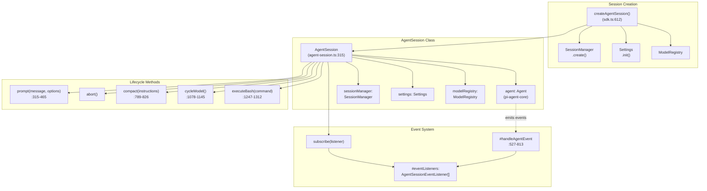
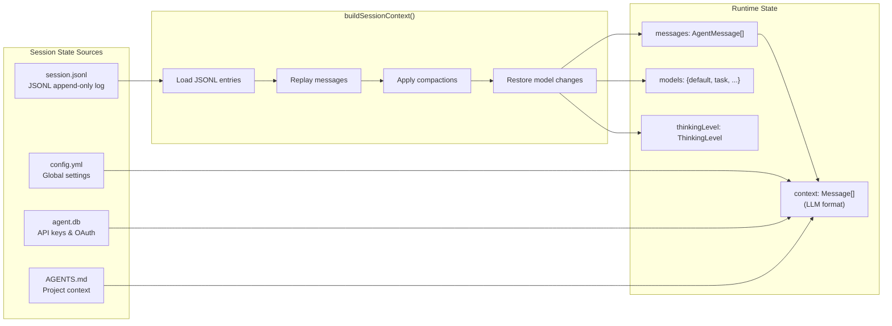

# Session Management

This document provides detailed information about session management within the `oh-my-pi` codebase, focusing on the `AgentSession` class and its related components. It covers the purpose, structure, key responsibilities, state composition, and event-driven persistence of sessions. Additionally, it describes how sessions are created, restored, and managed, including concepts like context compaction and branching.

## Agent Sessions: The Central Abstraction

The `AgentSession` class is the core component for managing an agent's runtime state. It acts as the primary interface for all execution modes (Interactive, RPC, Print) and extends the lower-level `Agent` from `@oh-my-pi/pi-agent-core` with session-specific functionalities such as persistence, auto-compaction, model cycling, bash execution, and event-driven updates .

### Purpose 

The `AgentSession` class is the primary interface for all three execution modes (Interactive, RPC, Print) . It wraps the lower-level `Agent` from `@oh-my-pi/pi-agent-core` and adds session-specific functionality: persistence, auto-compaction, model cycling, bash execution, and event-driven updates .

### Class Structure 

The `AgentSession` class is created by `createAgentSession()`  , which initializes it with a `SessionManager`, `Settings`, and `ModelRegistry` .




### Key Responsibilities 

The `AgentSession` handles various responsibilities: 

*   **Message Persistence**: Subscribes to agent events and writes them to a JSONL file .
*   **Model Management**: Manages model cycling and setting, including service tier enforcement .
*   **Auto-Compaction**: Monitors token usage and triggers compaction strategies to prevent context overflow .
*   **Auto-Retry**: Detects rate limits and retries operations with backoff .
*   **Bash Execution**: Integrates bash commands with session state .
*   **Todo Tracking**: Monitors todo completion and sends reminders .
*   **TTSR Integration**: Implements Time-traveling stream rules for pattern-based injection .
*   **Extension Hooks**: Emits lifecycle events for extension integration .

### Session State Composition 

The session state is reconstructed by the `buildSessionContext()` function in `SessionManager` . This function replays the `session.jsonl` log, processing each entry type (message, compaction, model change, thinking level change) to rebuild the conversation history .




### Event-Driven Persistence 

All agent events are processed by `#handleAgentEvent` . This function persists changes to `session.jsonl` via `SessionManager`, updates internal state, triggers maintenance tasks, and emits events to listeners . This ensures the session file is always synchronized with the runtime state, enabling replay and crash recovery .

## Session Management 

The `agent-browser` tool supports multiple isolated browser sessions with state persistence and concurrent browsing .

### Named Sessions 

You can use the `--session` flag to isolate browser contexts . For example: 

```bash
# Session 1: Authentication flow
agent-browser --session auth open https://app.example.com/login

# Session 2: Public browsing (separate cookies, storage)
agent-browser --session public open https://example.com

# Commands are isolated by session
agent-browser --session auth fill @e1 "user@example.com"
agent-browser --session public get text body
```


### Session Isolation Properties 

Each session maintains independent cookies, local/session storage, IndexedDB, cache, browsing history, and open tabs .

### Session State Persistence 

#### Save Session State 

You can save cookies, storage, and authentication state using `agent-browser state save` :

```bash
# Save cookies, storage, and auth state
agent-browser state save /path/to/auth-state.json
```


#### Load Session State 

To restore a saved state, use `agent-browser state load` :

```bash
# Restore saved state
agent-browser state load /path/to/auth-state.json

# Continue with authenticated session
agent-browser open https://app.example.com/dashboard
```


#### State File Contents 

A state file contains JSON data including cookies, localStorage, sessionStorage, and origins :

```json
{
  "cookies": [...],
  "localStorage": {...},
  "sessionStorage": {...},
  "origins": [...]
}
```


### Common Patterns 

#### Authenticated Session Reuse 

This pattern demonstrates saving and reusing an authenticated session :

```bash
#!/bin/bash
# Save login state once, reuse many times

STATE_FILE="/tmp/auth-state.json"

# Check if we have saved state
if [[ -f "$STATE_FILE" ]]; then
    agent-browser state load "$STATE_FILE"
    agent-browser open https://app.example.com/dashboard
else
    # Perform login
    agent-browser open https://app.example.com/login
    agent-browser snapshot -i
    agent-browser fill @e1 "$USERNAME"
    agent-browser fill @e2 "$PASSWORD"
    agent-browser click @e3
    agent-browser wait --load networkidle

    # Save for future use
    agent-browser state save "$STATE_FILE"
fi
```


#### Concurrent Scraping 

Multiple sites can be scraped concurrently using separate sessions :

```bash
#!/bin/bash
# Scrape multiple sites concurrently

# Start all sessions
agent-browser --session site1 open https://site1.com &
agent-browser --session site2 open https://site2.com &
agent-browser --session site3 open https://site3.com &
wait

# Extract from each
agent-browser --session site1 get text body > site1.txt
agent-browser --session site2 get text body > site2.txt
agent-browser --session site3 get text body > site3.txt

# Cleanup
agent-browser --session site1 close
agent-browser --session site2 close
agent-browser --session site3 close
```


#### A/B Testing Sessions 

Different user experiences can be tested using isolated sessions <

Wiki pages you might want to explore:
- [Core Concepts (DefaceRoot/oh-my-pi)](/wiki/DefaceRoot/oh-my-pi#3)

View this search on DeepWiki: https://app.devin.ai/search/give-me-the-complete-detailed_7dc53a8f-4eba-42ab-9bb9-8382d67c6cd2

